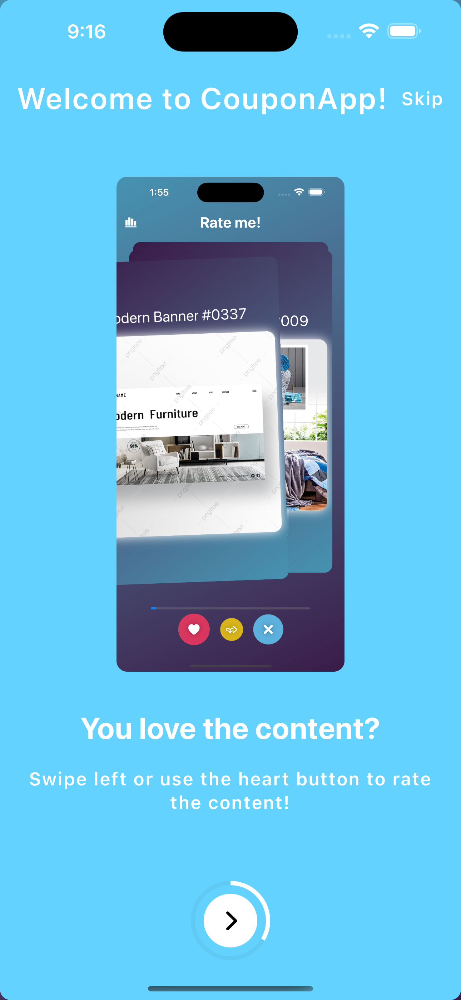

[![LinkedIn][linkedin-shield]][linkedin-url]

<!-- PROJECT LOGO -->
 

  

  <h3 align="center">Coupon App</h3>

<!-- ABOUT THE App -->
## About The App

Coupon App is a simple demo app for rating content. Uppon first install the user lands on the tutorial screen which consists of 3 steps, showing how the app works. After the tutorial the user can start with the rating! To keep the user in the app we designed the UI to be fast and responsive with varios interesting animations. To like/love the content the user can swipe left or simply press the heart button. For dislike swipe right or press the X mark button. You can also skip the content if you want to leave it for the end. At the top left corner there is a statistics view in which you can check the statistics (likes, dislikes). You don't need to rate all at once, come back whenever you are ready as the app will remember which image was the last shown and also remember the previosly rated content.

## Tutorial

## App Screens

<!-- CONTACT -->
## Contact

[Filip Kjamilov](https://www.linkedin.com/in/filip-kjamilov-379757157/) - filipkjamilov@gmail.com

[Youtube link](https://youtu.be/itSyAIKTPjk)

<!-- MARKDOWN LINKS & IMAGES -->

[linkedin-shield]: https://img.shields.io/badge/-LinkedIn-black.svg?style=for-the-badge&logo=linkedin&colorB=555
[linkedin-url]: https://www.linkedin.com/in/filip-kjamilov-379757157/